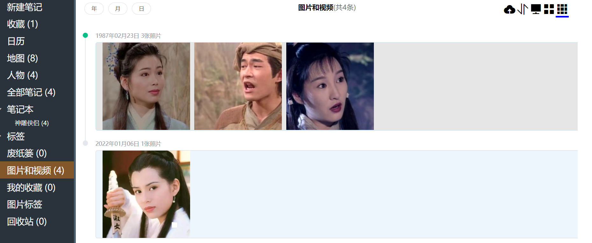
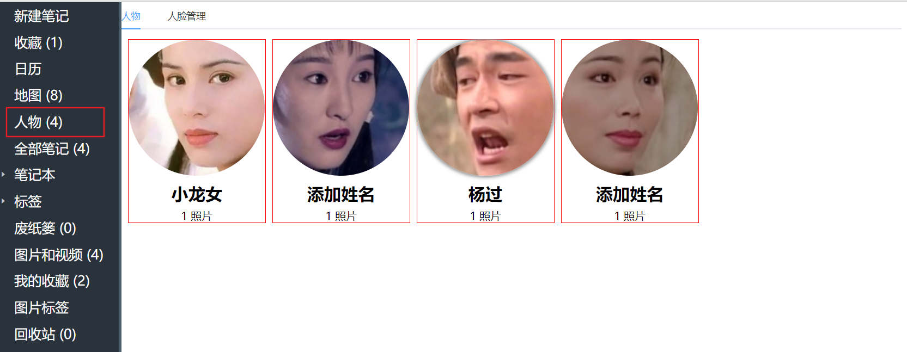
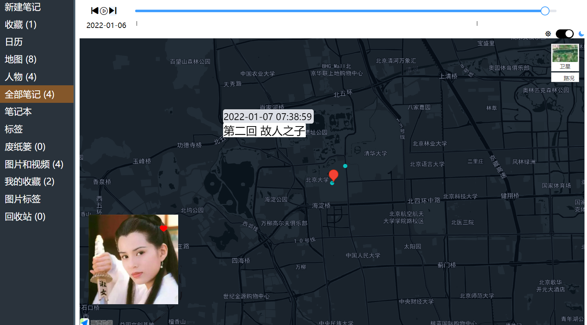
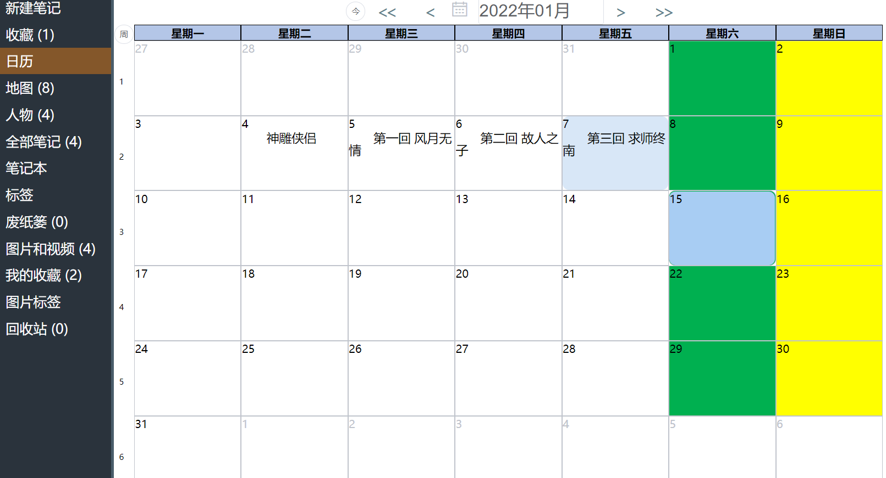

# 初衷

​      本人喜欢用印象笔记记录生活，也定期归档手机里的照片(比较耗时)，但是印象笔记却**没有地图视角**和**日历视角**，也无法对笔记中的照片进行归档。于是乎，调研看看有没有相关的笔记类应用能实现我的想法，暂未找到比较满意度，作为一个半路出家的**准程序员**，那就自己动手做一个吧。正好把刚刚学完的java框架和之前玩的人脸识别熟悉一哈。

- [演示demo](http://lpgogo.top/)

# 这个能干啥

## 1.支持md的笔记

- 支持md语言创作笔记
- 笔记本
- 笔记标签功能
- 点击地址跳转到地图视角

## 2.图片管理 

- 显示笔记中图片(带gps)

- 支持图片按照年月日视图展示

## 3.人脸识别

- 对所有的照片进行人脸识别
- 人脸的合并、移除、命名

## 4.笔记的地图视角

- 在地图上展示笔记创作的地点、切换地图模式和主题
- 在地图上标注图片的信息

- 支持前一天、后一天、自动播放
- 点击标题跳转到笔记列表

- 4.日历视角

对笔记进行月视图，看看自己这个月到底做了啥

#  开发信息

- 开发时间：耗时700h（2021.10--2021.12）

- 前端技术：vue、[vditor](https://b3log.org/vditor/demo/index.html?utm_source=ld246.com)、elementUI、[高德jsapi](https://lbs.amap.com/api/jsapi-v2/summary/)

- 后端技术：springboot、springcloud、mysql
- 其他：python(face_recognition)、docker、linux

# 待开发功能

- [ ] 历史上的今天(照片、笔记）
- [ ] 添加对图片其他形式的自动分类  如 风景，聚会，建筑等
- [ ] 照片一键导出(特定时间、特定人物)
- [ ] 加入搜索功能(es)
- [ ] 使用消息队列
- [ ] 加入事务

