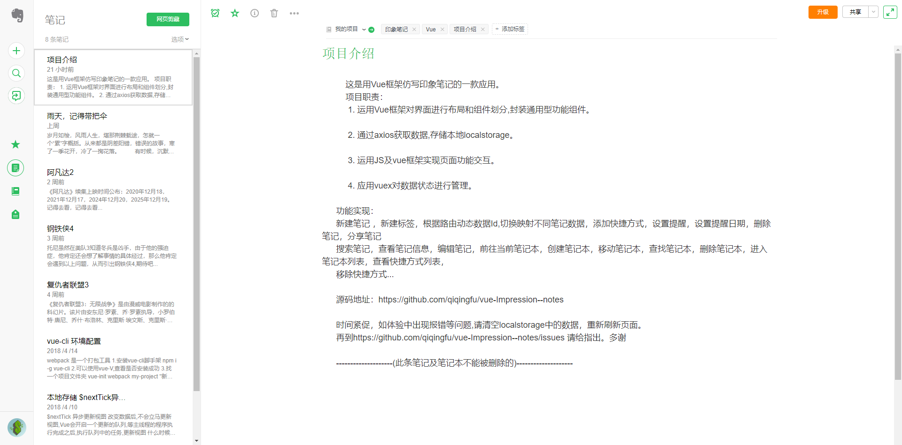
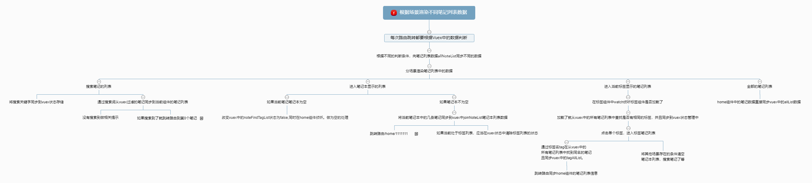
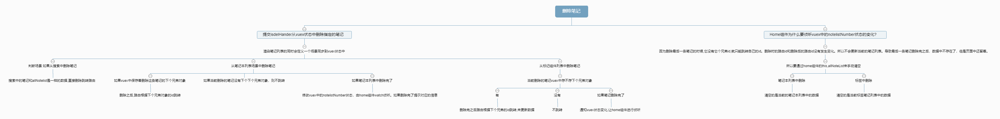
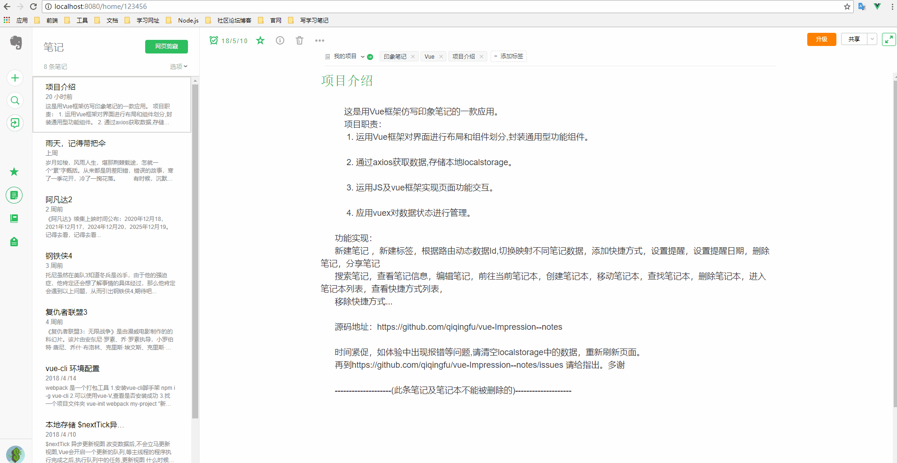
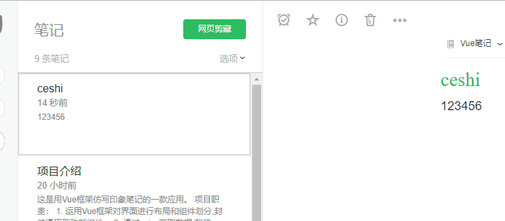
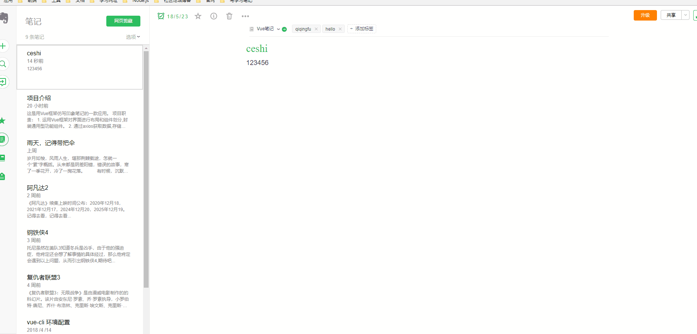
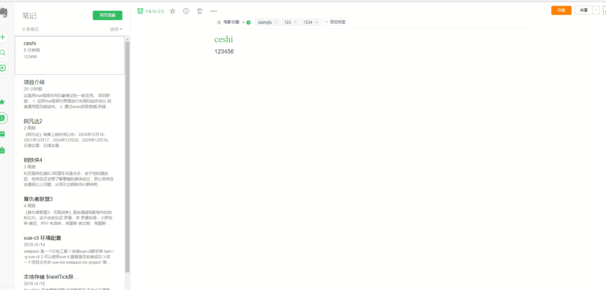
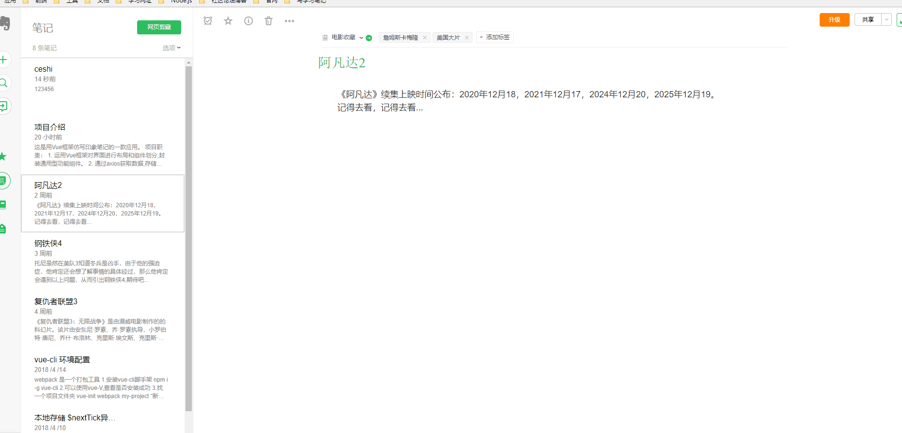
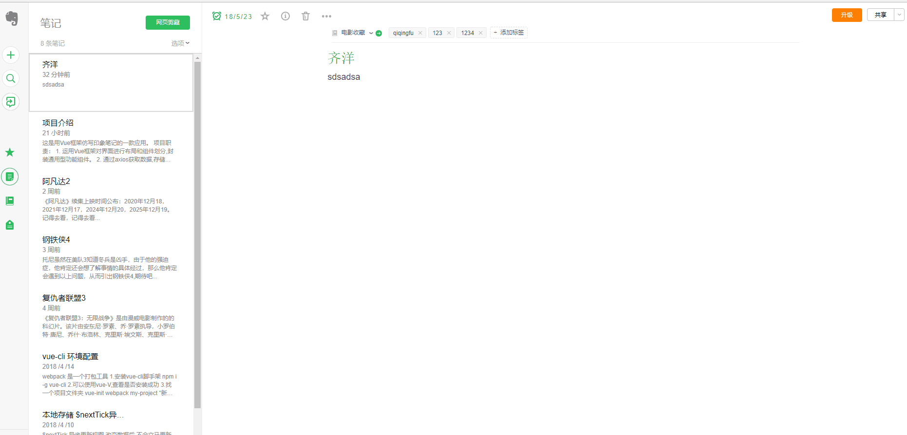

待完善功能：


加载本地文件在页面中显示

将访问的文件资源全部保存到本地


将文件直接保存到mysql数据库中

创建数据库

表设计

逻辑删除

一对多的设计  -- 存储


文件保存的问题：

直接存json，还是文件本身


文件

- [ ] 文件保存到本地
- [ ] markdown支持
- [ ] 导入和导出
- [ ] 将地图视角功能加入

标签

- [ ] 树形结构
- [ ] 拖拽添加

- [ ] 

图片

- [ ] 图片管理
- [ ] 登录
- [ ] 版本控制


本着复习vue的目的，找到了喜欢的印象笔记[demo](https://github.com/openexw/vue-Impression--notes)，通过阅读代码，反推出服务器请求的数据结构

修改了 请求数据时的小bug

使用步骤：

- 1.启动本地的 nginx或者 tomcat 将文件数据放进去
- 2.npm run dev


以下为原著 

----------------------------------------------------------------------------------------------------------------------------

## 说明

个人喜欢用印象笔记来记录技术笔记和技术总结,深深的感受到了这款应用带来的快捷,高效之处。以及很棒的用户体验和交互效果,对这款应用也是情有独钟。

以前学习vue的时候都是写一些小的展示性的demo,没有太强的交互效果。于是我就利用业余时间仔细的研究了印象笔记的数据处理以及交互细节。然后用自己的理解结合Vue框架逐步实现。实现了:新建笔记，删除笔记，添加标签，添加快捷方式，设置提醒，搜索笔记，查看笔记信息，进入当前笔记本，新建笔记本...功能

从遇到问题到分析问题然后再解决问题的那种快感...


#### [在线访问](http://evernote.wykiss.cn)

```__注:访问使用Chrome/firefox浏览器。```


**此项目纯属个人业余时间倒腾的,如果体验过程中出现BUG,清空本地localstorage,再重新请求数据。多多指教。**


## 技术栈

vue-cli + vue.js + vuex + vue-router + axios + webpack + iview + es6


## 项目职责

- 运用Vue框架对界面进行布局和组件划分,封装通用型功能组件。
- 通过axios获取数据,存储本地localstorage,实时同步vuex数据状态
- 运用JS及vue框架实现页面功能交互。
- 应用vuex对数据状态进行管理。


## 首页界面




## 功能实现
- [x] 新建笔记本
- [x] 切换笔记本
- [x] 添加标签
- [x] 添加快捷方式
- [x] 设置提醒
- [x] 查看笔记信息
- [x] 分享
- [x] 删除笔记本
- [x] 移动笔记本
- [x] 搜索笔记本
- [x] 进入当前笔记本
- [x] 搜索笔记
- [x] 查看快捷方式
- [x] 移除快捷方式
- [x] 进入快捷方式笔记
- [x] 编辑标签
- [x] 删除标签
- [x] 选项列表功能
- [x] 笔记列表排序
- [x] 同步新建时间
...


## 项目收获及总结
  - 经过这二十天左右的业余时间终于完成了这个稍微复杂交互的项目，因为也很喜欢这款应用和磨练一下vue技术熟练度。当初刚开始布局的时候就留下一个疑问，我到底能不能完成这个项目呢，答案是可以的。

  - 也让我更加深刻的理解了vuex状态管理和通用性组件的封装。在大型页面应用时，复杂切繁多的交互逻辑时，vuex的存在是不可缺的。所以说vuex和vue-router完全可以去做大型的交互单页面应用。

  - 项目中的笔记列表展示是根据不同的场景通过各种判断来渲染不同的数据内容，这一点也可以根据场景判断通过动态id来渲染列表数据。

  - 一些收获是文字无法描述的，只有实际写过才能深有体会，对交互改变数据，数据驱动视图有更深的体会。加油。


## [遇到的问题及解决方法](https://github.com/qiqingfu/vue-Impression--notes/issues)


#### 根据不同场景渲染不同笔记列表数据



#### 根据不同场景删除笔记数据,Home组件为什么要侦听vuex中的notelistNumber状态的变化?



## 项目部分截图

##### 新建笔记页


##### 设置提醒和添加快捷方式


##### 查看当前笔记信息和删除笔记


##### 选项菜单功能


##### 移动笔记和添加标签


##### 搜索笔记功能


##### 删除笔记本新建笔记本


##### [更多功能体验,点击这里](http://evernote.wykiss.cn)


